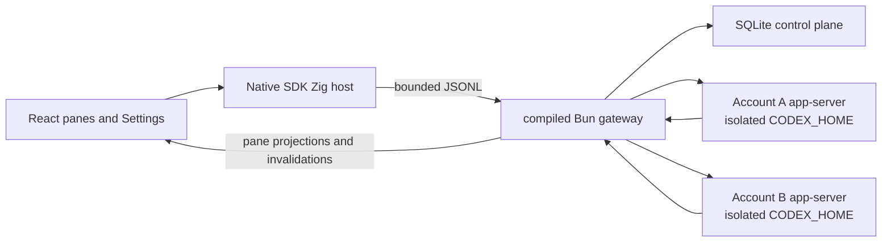

# HRA v0 for macOS

This directory preserves the archived HRA v0 macOS application and its final
v0.1.14 prerelease. The current HRA is at [hra.sh](https://hra.sh) in the
[current repository](https://github.com/hraness/hra). HRA v0 is a local-first
interface for long-running, parallel Codex work. Panes are repository-bound
chats that can run independently. Settings manages local Codex subscriptions.
HRA keeps the pane grid unavailable until at least one subscription is signed
in.

HRA does not require a separate HRA account for local use. It routes each prompt to a bounded model, reasoning, and service-tier profile, then exposes that read-only decision with the pane's current activity and latest assistant response. The gateway admits work only to an eligible signed-in subscription. A provider usage limit stops the affected work; HRA does not move that work to another subscription or use multiple subscriptions to circumvent provider limits.

## Supported platform

- Apple Silicon running macOS 13 or newer
- Bun 1.3.14 for repository development
- Zig 0.16.0, Xcode Command Line Tools, and the macOS SDK for native builds

The desktop build pins the Codex and Git versions it was tested against. Apple Silicon is the only supported native target until another target has matching runtime pins and acceptance evidence.

## Architecture



- The Zig host owns application lifecycle, the system WKWebView, trusted directory selection, and the bounded Native bridge.
- The compiled Bun gateway owns SQLite, Codex and Git processes, account routing, local execution, recovery, and destructive-data authority.
- The renderer receives pathless projections and app-owned commands. It never receives provider thread IDs, raw protocol messages, local paths, credentials, commands, or tool output.
- Each account gets a separate `CODEX_HOME` and durable process generation. A generation advances before replacement, so stale responses cannot reach a newer process.
- The renderer hydrates one atomic snapshot and applies ordered events. A sequence gap or `snapshot.invalidated` event triggers a fresh snapshot.

The gateway also contains the recursive-session v2 graph described in [`HARNESS.md`](HARNESS.md). It adds a closed lexical RLM program, encrypted completed-prefix and current-input context, persistent recursive actors, durable receipts, and bounded recovery while keeping Codex as the only model and transcript runtime.

## Scheduled chats

The clock control in a chat composer switches that chat into scheduling mode. Submit a natural-language instruction such as “Summarize today’s work every weekday at 5 PM.” HRA interprets it into a bounded prompt and a canonical RRULE. An instruction that cannot be interpreted leaves the draft and any existing schedule unchanged. Submit another instruction to replace the schedule, or turn the clock control off to remove it and return to an ordinary chat.

The pane header shows the next run as a concise relative time. HRA owns scheduling and sends each due occurrence through the chat’s normal durable message queue. It does not use a Codex app-server scheduled-task feature. Schedule definitions are encrypted before cloud sync; the relay stores the recurrence metadata it needs to wake the origin device but never receives the plaintext execution prompt. The origin HRA device executes occurrences while it is online, and missed intervals do not produce an unbounded catch-up burst.

## Shared execution access

The header contains one shared-folder control for every chat. It defaults to the user’s Documents directory. The selected folder is admitted as an additional runtime workspace root for every Codex turn, while each pane’s managed Git worktree remains its working directory and repository identity. The renderer receives only the folder’s display name, never its full path.

HRA applies one immutable execution policy: `danger-full-access`, approval policy `never`, and automatic approval review. Computer use is required and verified for each provider thread. It depends on the official signed Computer Use helper installed with the supported OpenAI application and the required macOS permissions. HRA does not copy or redistribute that helper, and it refuses the provider thread when the capability cannot be proven.

## Local state and account isolation

The current application-state root is:

```text
~/Library/Application Support/OPRTE/
  control-plane.sqlite
  codex/accounts/<profile-id>/
    home/
    runtime/
```

The `OPRTE` spelling is a retained on-disk compatibility identifier. Product copy and public commands use HRA.

Directories are checked for symlink escapes and repaired to user-only permissions. SQLite stores bounded HRA state such as profile labels, revisions, durable generations, pane state, receipts, account-routing evidence, recovery evidence, and the text needed for the latest response. Codex owns credentials, complete sessions, configuration, and logs inside each account home.

Removing a profile, deleting its local Codex data, and removing all HRA local data are separate operations. None of them deletes user repositories. Destructive flows require revision fences and exact confirmation; the shipping Panes and Settings interface does not expose whole-app removal.

## Local development

Install dependencies from the repository root:

```sh
bun install
```

Run the desktop development composition:

```sh
bun hra
```

`bun hra` starts HRA's malleable development composition. It builds an unminified gateway, incrementally compiles the Debug Zig host, starts Vite on `127.0.0.1:5173`, proves the listener with a fresh launch nonce, and opens the real WKWebView application against your local HRA state. The window title and a small `DEV` control show what the latest source edit needs.

| Changed source | Development behavior |
| --- | --- |
| Renderer components, styles, and renderer-only utilities | Vite applies the edit live. React state is usually preserved; a changed hook or export shape may remount that component. |
| Instruction and delegation text in `runtime/src/harness/actor-instruction-policy-v1.json` | HRA validates the bounded data and compiles a source-mapped candidate in the background. When the runtime is idle, use the `DEV` control to apply it. Newly started recursive actors use the updated instruction policy. The TypeScript parser and every other runtime file remain cold. The old generation closes cleanly and the renderer rehydrates from durable state. A failed validation or build leaves the running generation untouched. |
| Other gateway code, shared renderer/gateway contracts, gateway boot and durable recovery, account/session/Codex process code, projection installation, SQLite and persisted-state code, migrations, key custody, destructive maintenance, security, and release boundaries | Stop and rerun `bun hra`. Runtime code is cold by default; only reviewed pure kernels enter the apply lane, so a candidate cannot change durable or external authority before it is adopted. |
| Zig, Objective-C, `app.zon`, or `build.zig` | Stop and rerun `bun hra` to rebuild and reopen the native application. |
| The Vite configuration, development supervisor, package manifests, lockfile, or patches | Stop and rerun `bun hra` because the development session itself changed. |
| Tests and documentation | No running process changes. Run the relevant check normally. |

Ask the checked classifier about any repository-relative path:

```sh
bun run --cwd apps/desktop dev:classify -- apps/desktop/runtime/src/harness/actor-instruction-policy-v1.json
```

The runtime apply action never uses crash recovery as a reload mechanism. It first asks the current gateway to seal new work and refuses while authoritative work is active. The compiled candidate remains in a content-addressed sibling file while Native starts and verifies the exact next generation. HRA adopts it as the stable development gateway only after that generation is ready and the renderer has read a fresh authoritative snapshot. Compiler errors, superseded builds, and unconfirmed generations cannot replace the stable executable.

For renderer-only browser development:

```sh
bun run --cwd apps/desktop dev:frontend
```

The browser process cannot spawn Codex, select arbitrary filesystem paths, or inherit account homes. Use the native development composition for work that needs those capabilities.

## Deterministic Direct workbench

Run the isolated browser workbench:

```sh
bun run --cwd apps/desktop dev:direct
```

Direct serves the real React application on `127.0.0.1:5174` with deterministic in-memory transports and scenario state. It covers settings-only startup, pane creation and ordering, read-only HRA route decisions and fallbacks, streaming output, account routing, sign-in states, concurrent panes, and sequence-gap recovery. It opens no credentials, starts no gateway, and has no filesystem or deployment authority.

Use these focused checks:

```sh
bun run --cwd apps/desktop test:direct
bun run --cwd apps/desktop build:direct
bun run --cwd apps/desktop verify:direct
```

## Local-state maintenance

Stop HRA before running a maintenance command:

```sh
bun run --cwd apps/desktop state:doctor
bun run --cwd apps/desktop state:backup /absolute/new/backup.hra
bun run --cwd apps/desktop state:inspect /absolute/backup.hra
bun run --cwd apps/desktop state:verify /absolute/backup.hra
bun run --cwd apps/desktop state:restore /absolute/backup.hra
```

Backup and restore passphrases are accepted only through standard input. Backup creation is atomic and refuses to replace an existing archive. Inspection reads the bounded plaintext outer manifest without authenticating it. Verification authenticates that manifest as AEAD associated data together with every encrypted archive byte before restore.

The plaintext outer manifest exposes the backup timestamp, source release and migration, checkpoint proof, aggregate attachment count and bytes, payload length, KDF and cipher parameters, database, schema, vault, and portable-projection digests, the receipt-binding HMAC, and portable-projection counts. Those stable values can correlate archives. Attachment, pane, account, thread, and binding IDs; paths and filenames; transcript text; the attachment inventory; and per-blob hashes remain encrypted.

Backups authenticate the checkpointed SQLite snapshot, its bound receipt key, and a complete manifest plus byte-for-byte generation of the private attachment vault. The archive streams encrypted chunks so a valid full-size vault does not require a second in-memory copy. Backup and verification output report the conservative peak-resident estimate and maximum simultaneously buffered plaintext, while inspection and verification report the bounded attachment count and byte total. Account provider homes and rollout state are excluded, so restored attachment-bearing panes cannot resume their former provider context; they require an explicit fresh-context send, never a text-only retry of the old attachment turn. Backups also exclude Keychain items, managed worktrees, user repositories, and cloud session-sync ciphertext.

Turn off every scheduled chat before creating or restoring a portable backup. A schedule is bound to cloud and origin-device authority that the archive intentionally does not carry. Backup creation refuses active or pending schedule authority, and restore refuses to overwrite an installation that currently owns it. Cleared generation fences and terminal run history remain portable.

## OPRTE installation handoff

HRA keeps the bundle identifier `kitchen.hraness` and the state root `~/Library/Application Support/OPRTE` as compatibility custody. The supported handoff changes the visible application authority from `/Applications/OPRTE.app` to `/Applications/HRA.app`; it does not rename or copy live state into a new product root.

Run the handoff only after Suite Accounts v0.3.0 is the deployed account authority, the Accounts registry recognizes `hraness:hra:production:v1`, and `release-download.json` contains published v0.1.14 build 15 evidence. The command verifies that published source, the selected installation bundle, full state and Keychain continuity, both installed bundle archives, updater quiescence, and ordered AppKit shutdown before committing HRA as the sole visible application:

```sh
bun run installation:handoff \
  --candidate-app /absolute/path/to/HRA.app \
  --backup-directory /absolute/new/private-backup \
  --confirm RETIRE-OPRTE-IN-FAVOR-OF-HRA
```

An existing `/Applications/HRA.app` is accepted only when it is the exact v0.1.7 build 8, immutable v0.1.8 build 9, immutable v0.1.9 build 10, immutable v0.1.10 build 11, immutable v0.1.12 build 13, or current published v0.1.13 build 14 release. The handoff archives that prior app and can restore it through the bounded rollback path.

The exact OPRTE v0.1.4 build 5 predecessor uses the historical self-managed OPRTE Preview certificate chain, which current macOS can report as untrusted even when its signature bytes are unchanged. The handoff accepts that trust result only for the frozen predecessor tree, designated requirement, CodeDirectory, detached CMS signature, certificate fingerprints and chain, signed CMS time within the exact encoded leaf-certificate validity interval, root metadata, and extended-attribute inventory. Preview signing requested no secure timestamp. The pinned executable hash freezes the exact CMS bytes, and the verifier pins the signed time instead of making receipt-bound rollback depend on the current wall clock. The published v0.1.14 bundle, every supported prior HRA, and every other bundle remain subject to strict system code-signature verification. The receipt preserves the selected policy so archive, restart, rollback, and staging deletion checks cannot infer the exception from a bundle name or error message.

The retired annotated `v0.1.11` tag object `e4c171e33e414d74a36791fc8577cbfbcef8e52e` points directly to candidate commit `5a2a9842cacc75fee42ab8e23ca8c215a643e21e`. GitHub has no release or assets for that tag. HRA v0.1.11 build 12 is tagged-only historical evidence, never installed-app or rollback authority, and the tag must not be moved or reused.

HRA v0.1.12 build 13 remains published prior installed-app and rollback authority. Its direct annotated tag object `626be494d24733d12e53d09932cb5cc6218bc2fe` points to candidate commit `9ab991d08d1507fd73c9e7ef5fb4a37baee9c014`, and immutable GitHub prerelease `374867227` carries its exact seven assets. Publication commit `bfb60415c3eea7bc1021db8e8cc92f3e95800a46` records the release evidence. Its source `installation:handoff` must not initiate cutover because it self-detects the descriptor intentionally retained by the handoff process.

The immediate published predecessor is HRA v0.1.13 build 14. Its direct annotated tag object `44f00fd5c5e00bc8dcded0c9b176a8e37ada90f3` points to candidate commit `9ba06a441c9b12b448cfe34784432592dbeccb19`, and immutable GitHub prerelease `374920071` carries its exact seven assets. Publication commit `7825cb231890aa971f965412c31dfa2cb7796561` records the release evidence. It remains valid prior installed-app and rollback authority. Its source `installation:handoff` must not initiate cutover because it copies the candidate to a path ending in `.bundle`, which its strict packaged-app verifier rejects before installation. HRA v0.1.14 is the first corrected operator.

The backup directory must not exist. The operation creates it with user-only permissions and writes durable phase receipts. It rejects symbolic-link, case, Unicode-normalization, inode, process-birth, AppKit launch-identity, open-file, updater, receipt, custody, bundle, and Git-provenance ambiguity. A pre-commit interruption restores both original applications. An interruption after the committed receipt preserves HRA authority. Resume only its bounded, idempotent staging cleanup with the committed receipt:

```sh
bun run installation:cleanup \
  --backup-directory /absolute/private-backup \
  --confirm CLEAN-COMMITTED-HRA-HANDOFF-STAGING
```

Cleanup revalidates the committed candidate, requires the predecessor path to remain absent, and deletes only the exact receipt-bound predecessor and prior-HRA staging bundles. It can be rerun after any cleanup interruption.

Ordinary rollback is available only while the complete state tree still matches the pre-cutover receipt. HRA v0.1.11 through v0.1.14 use SQLite migration 62, but HRA's first normal launch writes the v0.1.14 build 15 release state and generation fence. That launch or any other state change makes this command refuse without touching either application:

```sh
bun run installation:rollback \
  --backup-directory /absolute/private-backup \
  --confirm ROLL-BACK-HRA-TO-OPRTE
```

Rollback restores filesystem application authority only. It does not lower the control-plane minimum-reader fence or make the restored application a compatible reader. When the state minimum reader is HRA v0.1.11 build 12 or newer, restored OPRTE v0.1.4 build 5 must remain closed. Recover forward with a compatible corrected HRA operator instead of launching OPRTE.

There is no destructive state-restore command after HRA has launched or changed
state. Restoring only the old SQLite tree cannot prove or restore the Keychain
slots it references, and could bind OPRTE to missing or rotated secrets. After
the ordinary rollback gate closes, keep HRA authoritative and use forward
repair plus explicit account, runner, and session reauthentication where
needed. The pre-cutover backup remains diagnostic evidence, not a complete
secret-custody restore image.

Keep the backup until the new installation, account flow, and local worktrees have been verified. These commands never rewrite historical tags or releases and never mutate a provider.

## Verification

Run portable desktop checks from the repository root:

```sh
bun run --cwd apps/desktop typecheck
bun run --cwd apps/desktop lint
bun run --cwd apps/desktop test
bun run --cwd apps/desktop test:property
bun run --cwd apps/desktop build
```

On an Apple Silicon Mac with the native toolchain:

```sh
bun run --cwd apps/desktop validate
bun run --cwd apps/desktop doctor:macos
bun run --cwd apps/desktop test:macos
bun run --cwd apps/desktop build:macos
bun run --cwd apps/desktop package:macos:adhoc
bun run --cwd apps/desktop package:macos
```

`build:macos` produces the ReleaseFast host and native helpers. `package:macos:adhoc` builds the self-contained app, stages the pinned Codex and Git runtimes with their notices, applies an inside-out ad-hoc signature, and creates the DMG and checksum without downloading release source archives. `package:macos` performs the full clean-tree release assembly and creates these artifacts:

```text
zig-out/release/macos/arm64/
  HRA-0.1.14-15-macos-arm64.dmg
  HRA-0.1.14-15-macos-arm64.dmg.sha256
  HRA-0.1.14-15-release-manifest.json
  bun-0d9b296af33f2b851fcbf4df3e9ec89751734ba4-source.tar.gz
  bun-webkit-5488984d20e0dbfe4be2c3ba8fb18eb81a5e0e8b-source.tar.gz
  git-67ad42147a7acc2af6074753ebd03d904476118f-source.tar.gz
  dugite-native-f49d0098409aa243de8b9162127025ab0bb07a88-source.tar.gz
```

The Bun archive is a deterministic complete-source bundle containing its pinned native build inputs, nested Git sources, Node headers, and locked `lol-html` Cargo closure. Patched WebKit and JavaScriptCore remain in their own archive because it is close to GitHub's 2 GiB asset limit. The Git and Dugite Native archives close the bundled Git source boundary. Full packaging requires network access and a clean source tree. CI uses `package:macos:adhoc` to verify the same compiler, runtime, and license pins, app, DMG, and checksum without downloading the large source archives.

The root `release-download.json` is the maintained archive contract for the
published HRA v0.1.14 build 15 prerelease. It names
`https://github.com/hraness/hra-v0` and records the fixed source commit, tag
object, runtime-tree digest, artifact byte counts, and SHA-256 digests used by
the download page.

The immutable publication history remains separate from that maintained
repository coordinate:

- Candidate C is `7b39c459827b2acf45aa2d911c94fdb5d4f37860`.
- Publication P is `6221f79b745f154882080936b961ff431569f33e`.
- Annotated tag object `37ed37afb39cacfd6a51044cf7f3c1b873571aa3`
  points directly to C.

C contains the historical candidate contract. P is C's sole child and changes
only `release-download.json` from that candidate state to the complete
published evidence. Both commits record the repository's name at publication,
`https://github.com/hraness/hra`. The GitHub repository rename moves the same
tag, immutable release, and seven assets to `hraness/hra-v0`; it does not
recreate or republish them.

The archive surface performs one reviewed navigation migration in
`release-download.json`: only the repository coordinate changes from
`hraness/hra` to `hraness/hra-v0`. Every release, source, and artifact value,
and every other contract byte, remains equal to P. The source gate proves the
exact C-to-P transition and tag, requires the checked archive surface to
descend from P, and requires exactly one single-parent contract change with
that exact historical-to-archive byte replacement. Another path at P, another
parent, another contract edit, a rewrite and restore, tag drift, or artifact
drift fails closed.

Run the archive checks from a clean standalone checkout:

```sh
bun run --cwd apps/desktop check:release-contract
bun run check:release-source
bun run verify:remote-release
```

Release provenance comes from the checkout, never a caller-supplied commit.
The gate requires the canonical repository top-level with a real `.git`
directory, a clean tree, no submodules, alternates, grafts, replacement refs,
shallow history, or included local Git configuration. It rejects inherited
`GIT_*` variables, runs `/usr/bin/git` with explicit Git and work-tree paths,
and disables global and system configuration.

The remote gate reads the immutable v0.1.14 prerelease from
`hraness/hra-v0`. It checks the exact seven-asset set, upload state, canonical
URLs, byte counts, GitHub SHA-256 digests, checksum-to-DMG binding, release
manifest, and all four corresponding-source records. It does not redownload
the multi-gigabyte immutable assets. A mutable, incomplete, additional, or
different release fails. Do not create another v0.1.14 release, move its tag,
replace an asset, or run the former publication procedure again.

The immutable published HRA v0.1.8 build 9, v0.1.9 build 10, v0.1.10 build 11,
v0.1.12 build 13, and v0.1.13 build 14 prereleases remain historical evidence.
The retired tagged-only v0.1.11 build 12 candidate is not a published release
and must never be accepted as prior installed authority. Do not replace or
reuse any historical tag, release, version, build, or asset.

The ad-hoc package proves bundle integrity but does not identify a registered Apple developer. macOS may require **Privacy & Security → Open Anyway** after download. It is not notarized, and automatic updates remain disabled. Developer ID signing, notarization, and publication require separately provisioned release credentials.

Verify an existing package without rebuilding it:

```sh
bun run --cwd apps/desktop verify:package:macos
bun run --cwd apps/desktop verify:package:macos:adhoc
```

The explicit launch smoke starts the packaged native executable and its bundled gateway for a bounded interval, verifies their pinned runtime identity through an owned temporary marker, and then terminates the exact process group. The smoke path does not initialize AppKit, WebKit, updater state, account profiles, or Keychain custody, and removes its private temporary root in `finally`:

```sh
bun run --cwd apps/desktop smoke:package:macos
```

## Manual account-isolation smoke

Use throwaway repositories and two test Codex subscriptions. Do not record emails, OAuth URLs, device codes, tokens, prompts, approval answers, or local paths.

- Sign both subscriptions in and confirm one profile's authentication and budget state never changes the other.
- Run parallel turns and confirm each pane receives only its own bounded response and activity.
- Trigger deterministic usage-limit, approval, stale-turn, duplicated-terminal, and interrupted-runtime fixtures. Confirm the affected pane stops without cross-subscription continuation or repainting another pane.
- Quit and reopen HRA. Confirm pane order, account selection, and distinct process generations recover without cross-profile prompts.
- Inspect diagnostics and SQLite. Confirm they contain no credentials, raw provider payloads, tool details, local paths, or full transcripts.
