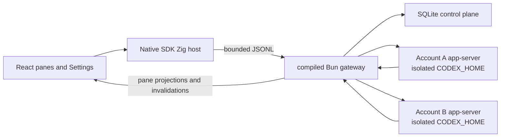

# HRA v0 for macOS

This directory preserves the archived HRA v0 macOS application. Its
generation-1 release ledger currently ends at the immutable v0.1.15 recovery
release. HRA v0.1.16 build 17 is the checked native compatibility correction
candidate C17. The current HRA is at
[hra.sh](https://hra.sh) in the
[current repository](https://github.com/hraness/hra). HRA v0 is a local-first
interface for long-running, parallel Codex work. Panes are repository-bound
chats that can run independently. Settings manages local Codex subscriptions.
HRA keeps the pane grid unavailable until at least one subscription is signed
in.

HRA does not require a separate HRA account for local use. It routes each prompt to a bounded model, reasoning, and service-tier profile, then exposes that read-only decision with the pane's current activity and latest assistant response. The gateway admits work only to an eligible signed-in subscription. A provider usage limit stops the affected work; HRA does not move that work to another subscription or use multiple subscriptions to circumvent provider limits.

## Supported platform

- Apple Silicon running macOS 13 or newer
- Bun 1.3.14 for repository development
- Zig 0.16.0, Xcode Command Line Tools, and the macOS SDK for native builds

The desktop build pins the Codex and Git versions it was tested against. Apple Silicon is the only supported native target until another target has matching runtime pins and acceptance evidence.

## Architecture



- The Zig host owns application lifecycle, the system WKWebView, trusted directory selection, and the bounded Native bridge.
- The compiled Bun gateway owns SQLite, Codex and Git processes, account routing, local execution, recovery, and destructive-data authority.
- The renderer receives pathless projections and app-owned commands. It never receives provider thread IDs, raw protocol messages, local paths, credentials, commands, or tool output.
- Each account gets a separate `CODEX_HOME` and durable process generation. A generation advances before replacement, so stale responses cannot reach a newer process.
- The renderer hydrates one atomic snapshot and applies ordered events. A sequence gap or `snapshot.invalidated` event triggers a fresh snapshot.

The gateway also contains the recursive-session v2 graph described in [`HARNESS.md`](HARNESS.md). It adds a closed lexical RLM program, encrypted completed-prefix and current-input context, persistent recursive actors, durable receipts, and bounded recovery while keeping Codex as the only model and transcript runtime.

## Scheduled chats

The clock control in a chat composer switches that chat into scheduling mode. Submit a natural-language instruction such as “Summarize today’s work every weekday at 5 PM.” HRA interprets it into a bounded prompt and a canonical RRULE. An instruction that cannot be interpreted leaves the draft and any existing schedule unchanged. Submit another instruction to replace the schedule, or turn the clock control off to remove it and return to an ordinary chat.

The pane header shows the next run as a concise relative time. HRA owns scheduling and sends each due occurrence through the chat’s normal durable message queue. It does not use a Codex app-server scheduled-task feature. Schedule definitions are encrypted before cloud sync; the relay stores the recurrence metadata it needs to wake the origin device but never receives the plaintext execution prompt. The origin HRA device executes occurrences while it is online, and missed intervals do not produce an unbounded catch-up burst.

## Shared execution access

The header contains one shared-folder control for every chat. It defaults to the user’s Documents directory. The selected folder is admitted as an additional runtime workspace root for every Codex turn, while each pane’s managed Git worktree remains its working directory and repository identity. The renderer receives only the folder’s display name, never its full path.

HRA applies one immutable execution policy: `danger-full-access`, approval policy `never`, and automatic approval review. Computer use is required and verified for each provider thread. It depends on the official signed Computer Use helper installed with the supported OpenAI application and the required macOS permissions. HRA does not copy or redistribute that helper, and it refuses the provider thread when the capability cannot be proven.

## Local state and account isolation

The current application-state root is:

```text
~/Library/Application Support/OPRTE/
  control-plane.sqlite
  codex/accounts/<profile-id>/
    home/
    runtime/
```

The `OPRTE` spelling is a retained on-disk compatibility identifier. Product copy and public commands use HRA.

Directories are checked for symlink escapes and repaired to user-only permissions. SQLite stores bounded HRA state such as profile labels, revisions, durable generations, pane state, receipts, account-routing evidence, recovery evidence, and the text needed for the latest response. Codex owns credentials, complete sessions, configuration, and logs inside each account home.

Removing a profile, deleting its local Codex data, and removing all HRA local data are separate operations. None of them deletes user repositories. Destructive flows require revision fences and exact confirmation; the shipping Panes and Settings interface does not expose whole-app removal.

## Local development

Install dependencies from the repository root:

```sh
bun install
```

Run the desktop development composition:

```sh
bun hra
```

`bun hra` starts HRA's malleable development composition. It builds an unminified gateway, incrementally compiles the Debug Zig host, starts Vite on `127.0.0.1:5173`, proves the listener with a fresh launch nonce, and opens the real WKWebView application against your local HRA state. The window title and a small `DEV` control show what the latest source edit needs.

| Changed source | Development behavior |
| --- | --- |
| Renderer components, styles, and renderer-only utilities | Vite applies the edit live. React state is usually preserved; a changed hook or export shape may remount that component. |
| Instruction and delegation text in `runtime/src/harness/actor-instruction-policy-v1.json` | HRA validates the bounded data and compiles a source-mapped candidate in the background. When the runtime is idle, use the `DEV` control to apply it. Newly started recursive actors use the updated instruction policy. The TypeScript parser and every other runtime file remain cold. The old generation closes cleanly and the renderer rehydrates from durable state. A failed validation or build leaves the running generation untouched. |
| Other gateway code, shared renderer/gateway contracts, gateway boot and durable recovery, account/session/Codex process code, projection installation, SQLite and persisted-state code, migrations, key custody, destructive maintenance, security, and release boundaries | Stop and rerun `bun hra`. Runtime code is cold by default; only reviewed pure kernels enter the apply lane, so a candidate cannot change durable or external authority before it is adopted. |
| Zig, Objective-C, `app.zon`, or `build.zig` | Stop and rerun `bun hra` to rebuild and reopen the native application. |
| The Vite configuration, development supervisor, package manifests, lockfile, or patches | Stop and rerun `bun hra` because the development session itself changed. |
| Tests and documentation | No running process changes. Run the relevant check normally. |

Ask the checked classifier about any repository-relative path:

```sh
bun run --cwd apps/desktop dev:classify -- apps/desktop/runtime/src/harness/actor-instruction-policy-v1.json
```

The runtime apply action never uses crash recovery as a reload mechanism. It first asks the current gateway to seal new work and refuses while authoritative work is active. The compiled candidate remains in a content-addressed sibling file while Native starts and verifies the exact next generation. HRA adopts it as the stable development gateway only after that generation is ready and the renderer has read a fresh authoritative snapshot. Compiler errors, superseded builds, and unconfirmed generations cannot replace the stable executable.

For renderer-only browser development:

```sh
bun run --cwd apps/desktop dev:frontend
```

The browser process cannot spawn Codex, select arbitrary filesystem paths, or inherit account homes. Use the native development composition for work that needs those capabilities.

## Deterministic Direct workbench

Run the isolated browser workbench:

```sh
bun run --cwd apps/desktop dev:direct
```

Direct serves the real React application on `127.0.0.1:5174` with deterministic in-memory transports and scenario state. It covers settings-only startup, pane creation and ordering, read-only HRA route decisions and fallbacks, streaming output, account routing, sign-in states, concurrent panes, and sequence-gap recovery. It opens no credentials, starts no gateway, and has no filesystem or deployment authority.

Use these focused checks:

```sh
bun run --cwd apps/desktop test:direct
bun run --cwd apps/desktop build:direct
bun run --cwd apps/desktop verify:direct
```

## Local-state maintenance

Stop HRA before running a maintenance command:

```sh
bun run --cwd apps/desktop state:doctor
bun run --cwd apps/desktop state:backup /absolute/new/backup.hra
bun run --cwd apps/desktop state:inspect /absolute/backup.hra
bun run --cwd apps/desktop state:verify /absolute/backup.hra
bun run --cwd apps/desktop state:restore /absolute/backup.hra
```

Backup and restore passphrases are accepted only through standard input. Backup creation is atomic and refuses to replace an existing archive. Inspection reads the bounded plaintext outer manifest without authenticating it. Verification authenticates that manifest as AEAD associated data together with every encrypted archive byte before restore.

The plaintext outer manifest exposes the backup timestamp, source release and migration, checkpoint proof, aggregate attachment count and bytes, payload length, KDF and cipher parameters, database, schema, vault, and portable-projection digests, the receipt-binding HMAC, and portable-projection counts. Those stable values can correlate archives. Attachment, pane, account, thread, and binding IDs; paths and filenames; transcript text; the attachment inventory; and per-blob hashes remain encrypted.

Backups authenticate the checkpointed SQLite snapshot, its bound receipt key, and a complete manifest plus byte-for-byte generation of the private attachment vault. The archive streams encrypted chunks so a valid full-size vault does not require a second in-memory copy. Backup and verification output report the conservative peak-resident estimate and maximum simultaneously buffered plaintext, while inspection and verification report the bounded attachment count and byte total. Account provider homes and rollout state are excluded, so restored attachment-bearing panes cannot resume their former provider context; they require an explicit fresh-context send, never a text-only retry of the old attachment turn. Backups also exclude Keychain items, managed worktrees, user repositories, and cloud session-sync ciphertext.

HRA v0.1.15 adds a machine-local enrollment sidecar that binds the recursive-harness envelope to one strict Keychain item. Portable backup creation does not archive that sidecar or the Keychain item. Restore requires an already enrolled local authority, captures its file before replacing portable state, and requires the exact bytes and inode to remain unchanged afterward. A missing or changed local enrollment fails without substituting or regenerating custody.

Turn off every scheduled chat before creating or restoring a portable backup. A schedule is bound to cloud and origin-device authority that the archive intentionally does not carry. Backup creation refuses active or pending schedule authority, and restore refuses to overwrite an installation that currently owns it. Cleared generation fences and terminal run history remain portable.

## Installation handoff and forward recovery

HRA keeps the bundle identifier `kitchen.hraness` and the state root `~/Library/Application Support/OPRTE` as compatibility custody. The supported handoff changes the visible application authority from `/Applications/OPRTE.app` to `/Applications/HRA.app`; it does not rename or copy live state into a new product root.

Run the ordinary handoff only after Suite Accounts v0.3.0 is the deployed account authority, the Accounts registry recognizes `hraness:hra:production:v1`, and `release-download.json` contains published v0.1.15 build 16 evidence. The command verifies that published source, the candidate bundle, full state and Keychain continuity, both installed bundle archives, updater quiescence, and ordered AppKit shutdown before making HRA the sole visible application:

```sh
bun run installation:handoff \
  --candidate-app /absolute/path/to/HRA.app \
  --backup-directory /absolute/new/private-backup \
  --confirm RETIRE-OPRTE-IN-FAVOR-OF-HRA
```

An existing `/Applications/HRA.app` is accepted only when it is an exact published prior release: v0.1.7 build 8, v0.1.8 build 9, v0.1.9 build 10, v0.1.10 build 11, v0.1.12 build 13, v0.1.13 build 14, or v0.1.14 build 15. The handoff binds that prior app into its durable evidence.

The exact OPRTE v0.1.4 build 5 predecessor uses the historical self-managed OPRTE Preview certificate chain, which current macOS can report as untrusted even when its signature bytes are unchanged. The handoff accepts that trust result only for the frozen predecessor tree, designated requirement, CodeDirectory, detached CMS signature, certificate fingerprints and chain, signed CMS time within the exact encoded leaf-certificate validity interval, root metadata, and extended-attribute inventory. Preview signing requested no secure timestamp. The pinned executable hash freezes the exact CMS bytes, and the verifier pins the signed time instead of making receipt-bound recovery depend on the current wall clock. The v0.1.15 package must match HRA's exact current self-managed production authority. Historical HRA releases retain their frozen package policies. The receipt preserves the selected policy so archive, restart, cleanup, and any permitted prepublication rollback cannot infer an exception from a bundle name or error message.

The retired annotated `v0.1.11` tag object `e4c171e33e414d74a36791fc8577cbfbcef8e52e` points directly to candidate commit `5a2a9842cacc75fee42ab8e23ca8c215a643e21e`. GitHub has no release or assets for that tag. HRA v0.1.11 build 12 is tagged-only historical evidence, never installed-app or rollback authority, and the tag must not be moved or reused.

HRA v0.1.12 build 13 and v0.1.13 build 14 remain published prior installed-app authority. The v0.1.12 tag object `626be494d24733d12e53d09932cb5cc6218bc2fe` points to candidate `9ab991d08d1507fd73c9e7ef5fb4a37baee9c014`; publication commit `bfb60415c3eea7bc1021db8e8cc92f3e95800a46` records its release. The v0.1.13 tag object `44f00fd5c5e00bc8dcded0c9b176a8e37ada90f3` points to candidate `9ba06a441c9b12b448cfe34784432592dbeccb19`; publication commit `7825cb231890aa971f965412c31dfa2cb7796561` records its release. Their source handoff operators remain retired.

HRA v0.1.14 build 15 remains the frozen forward-recovery origin for the published v0.1.15 correction. Its direct annotated tag object `37ed37afb39cacfd6a51044cf7f3c1b873571aa3` points to candidate commit `7b39c459827b2acf45aa2d911c94fdb5d4f37860`, and publication commit `6221f79b745f154882080936b961ff431569f33e` records the immutable release evidence. Preserve those exact objects, assets, and the original handoff backup. A v0.1.14 installation that completed its handoff but cannot start must use the bounded v0.1.14-to-v0.1.15 forward recovery below. Do not launch OPRTE or use an older handoff operator.

The ordinary handoff backup directory must not exist. The schema-v3 operation creates it with user-only permissions and writes separate immutable authorization evidence and a forward-only progress journal. Status is observational and reports an exact durable next-history leaf without promoting it:

```sh
bun run installation:status \
  --backup-directory /absolute/private-backup
```

Before the durable candidate-publish boundary, an interruption can remove only its exact uncommitted staging and enrollment authorization under the original Keychain lease. Once publication might have swapped an installed path, recovery is forward-only. It never swaps the old app back, even when a postpublication proof fails. Resume the exact journal with its distinct confirmation:

```sh
bun run installation:resume \
  --backup-directory /absolute/private-backup \
  --confirm RESUME-HRA-INSTALLATION-HANDOFF-V3
```

After status reports `committed`, remove only receipt-bound staging:

```sh
bun run installation:cleanup \
  --backup-directory /absolute/private-backup \
  --confirm CLEAN-COMMITTED-HRA-HANDOFF-STAGING
```

`installation:rollback` accepts only an exact schema-v3 prepublication state and requires `--confirm ROLL-BACK-HRA-TO-OPRTE`. HRA v0.1.11 through v0.1.15 use SQLite migration 62, but HRA's first normal v0.1.15 launch writes the v0.1.15 build 16 release state and generation fence. A launch, custody creation, application publication, or any other protected-state change closes rollback. Keep the published HRA path authoritative and recover forward.

The ordinary commands never run the retired schema-v2 mutator. When their backup directory contains a schema-v2 `handoff-receipt.json`, they stop with command-specific guidance. Only the isolated v0.1.14 forward-recovery commands below may read the frozen schema-v2 receipt, and only as the exact committed recovery origin they specify.

### Recover an exact v0.1.14 installation forward

Use this path only for an exact published v0.1.14 build 15 app whose frozen schema-v2 handoff receipt is committed. Keep both apps closed. Supply that operation's original backup directory and a new empty recovery directory:

```sh
bun run installation:forward-recovery \
  --candidate-app /absolute/path/to/HRA-0.1.15-16-macos-arm64.app \
  --origin-handoff-backup-directory /absolute/v0.1.14-handoff-backup \
  --backup-directory /absolute/new/v0.1.15-forward-recovery \
  --confirm FORWARD-RECOVER-HRA-0.1.14-TO-0.1.15
```

The operator freezes the exact published v0.1.14 origin, v0.1.15 package, original receipt, installed paths, protected state, and custody observation under its locks. It writes the machine-local enrollment authorization before staging the package. Once the single atomic application swap might have occurred, it never reverses that swap and retains the exact old-app tombstone for explicit cleanup.

Inspect an interrupted operation before deciding what to do:

```sh
bun run installation:forward-status \
  --backup-directory /absolute/v0.1.15-forward-recovery
```

Status does not open the UI, database, or release fence. Its bounded no-UI custody probe reports only strict-ACL absence or the enrolled envelope digest. Resume only the exact receipt-bound operation:

```sh
bun run installation:forward-resume \
  --backup-directory /absolute/v0.1.15-forward-recovery \
  --confirm RESUME-FORWARD-HRA-RECOVERY
```

After status reports `complete`, delete only its verified staging and retained tombstone:

```sh
bun run installation:forward-cleanup \
  --backup-directory /absolute/v0.1.15-forward-recovery \
  --confirm CLEAN-FORWARD-HRA-RECOVERY
```

The first normal v0.1.15 launch advances enrollment monotonically from its authorized sidecar through prepared custody to `enrolled`. It creates the exact strict-ACL Keychain item only when both the authorization and Keychain absence are proven. An enrolled installation never regenerates that key. A missing item, changed envelope digest, weaker access control, or changed sidecar fails closed.

### v0.1.15 to v0.1.16 Keychain compatibility

The first v0.1.16 launch from an exact prepared v0.1.15 recovery may show the legacy macOS Keychain password prompt. macOS 26 can persist the required partition transition after either Allow or Always Allow. If a second prompt appears, choose Always Allow so a fresh helper process can finish the update. The legacy dialog does not reliably display HRA's custom operation text.

Canceling the prompt or reaching the bounded timeout leaves the immutable sidecar in `prepared`, so the next launch can retry safely. HRA changes that sidecar to `enrolled` only after a separate no-UI read proves the unchanged envelope digest and the exact five-ACL current-helper shape. The envelope and password never cross the digest-only migration protocol.

There is no destructive state-restore command after HRA has launched or changed state. Restoring only the old SQLite tree cannot prove or restore the Keychain slots it references. The pre-cutover and forward-recovery backups remain diagnostic evidence rather than complete secret-custody images. Keep them until the v0.1.15 installation, account flow, and local worktrees have been verified. These commands never rewrite historical tags or releases and never mutate a provider.

## Verification

Run portable desktop checks from the repository root:

```sh
bun run --cwd apps/desktop typecheck
bun run --cwd apps/desktop lint
bun run --cwd apps/desktop test
bun run --cwd apps/desktop test:property
bun run --cwd apps/desktop build
```

On an Apple Silicon Mac with the native toolchain:

```sh
bun run --cwd apps/desktop validate
bun run --cwd apps/desktop doctor:macos
bun run --cwd apps/desktop test:macos
bun run --cwd apps/desktop build:macos
bun run --cwd apps/desktop package:macos:structural
bun run --cwd apps/desktop package:macos
```

`build:macos` produces the ReleaseFast host and native helpers. `package:macos:structural` creates a temporary build-isolated Keychain and ephemeral CMS chain, signs the structural app inside-out, verifies that the user's Keychain search list was never changed, destroys the fixture custody, and places its signed result at `zig-out/structural/package/HRA-structural.app`. It creates no release DMG. Its manifest is explicitly `releaseEligible: false`; production, DMG, candidate, publication, and download gates reject it.

`package:macos` requires the exact locally provisioned HRA release authority pinned by public root and leaf certificate hashes. It applies self-managed CMS signatures to the outer app, native host, and custody-authorizing helpers. Other HRA-owned nested executables retain exact pinned ad-hoc signatures, including the runtime/JIT gateway. The command verifies the package and adversarial replacement matrix before creating these full clean-tree release artifacts:

```text
zig-out/release/macos/arm64/
  HRA-0.1.16-17-macos-arm64.dmg
  HRA-0.1.16-17-macos-arm64.dmg.sha256
  HRA-0.1.16-17-release-manifest.json
  bun-0d9b296af33f2b851fcbf4df3e9ec89751734ba4-source.tar.gz
  bun-webkit-5488984d20e0dbfe4be2c3ba8fb18eb81a5e0e8b-source.tar.gz
  git-67ad42147a7acc2af6074753ebd03d904476118f-source.tar.gz
  dugite-native-f49d0098409aa243de8b9162127025ab0bb07a88-source.tar.gz
```

The Bun archive is a deterministic complete-source bundle containing its pinned native build inputs, nested Git sources, Node headers, and locked `lol-html` Cargo closure. Patched WebKit and JavaScriptCore remain in their own archive because it is close to GitHub's 2 GiB asset limit. The Git and Dugite Native archives close the bundled Git source boundary. Full packaging requires network access, a clean source tree, and local production signing custody. CI uses `package:macos:structural` to verify the compiler, runtime, license, package-shape, and signature-policy boundary without production custody, a DMG, or the large source archives.

The root `release-download.json` is the strict HRA v0.1.16 build 17 download
and publication contract for `https://github.com/hraness/hra-v0`. C17 keeps
artifact hashes and source identities null, so the website exposes no v0.1.16
download. The immutable v0.1.15 release remains the current frozen ledger
entry and the v0.1.14 origin remains available for its bounded forward
recovery.

The separate root `release-history.json` is the generation-1 compatibility
ledger. It fixes the v0.1.7–v0.1.15 annotated tags, eight immutable GitHub
releases, 56 assets, and v0.1.11 tag-only state. Remote verification requires
that exact set and preserves the v0.1.15 tag, release, assets, and frozen P15
publication evidence while v0.1.16 is a candidate.

Publication uses two commits so no commit must contain its own object ID.
Candidate C15 `0c7764da0dea0a71bbccca817539a02d8e4284d0`
retains the null contract; the package, annotated `v0.1.15` tag, manifest, app,
DMG, and checksum all name C15. Publication P15
`d96173c3556799cb203a4d659f29856180838029` is C15's exact contract-only child.
An already accepted repository change U
`559c272f1bd7a2f1195f1af3c493b4f73a8fb3d2` also descends directly from C15.
Integration bridge M15 `af3296e59e2173e1e7737dee7a3194592de1105e`
has ordered parents `[P15, U]`, preserves P15's download contract byte for
byte, and is followed by the single Q15 archive-surface commit. The verifier
rejects parent-order drift, candidate drift, a tag that
does not peel to C15, or artifacts that do not embed C15 and its runtime-tree
digest. Q15 is `443448b79e9016e00d52501f047fce3a408de092`. Compatibility
commit C16 is `4766793434e59cfe3fb3e8bf5fe57e2a28e72aeb`, Q15's
single-parent direct child. The final C17 candidate must be C16's
single-parent direct child. P16 must be C17's exact contract-only child, and
Q16 must be P16's single direct archive-surface child without changing the
published contract.

C17 exists because C16's runtime requests a 240-second interactive ACL
validation and migration budget while its Objective-C admission boundary still
caps the operation at 60 seconds. C17 aligns that boundary before any v0.1.16
publication.

The active `main` rulesets require a pull request, the strict `Required` status
check on an up-to-date head, resolved review threads, and linear history; only
squash and rebase merges are allowed. `Required` verifies both the pull-request
head and the resulting `main` push. Keep the correction based on exact C16 and
integrate it as one direct child. If a squash or rebase changes the object ID,
the resulting `main` commit is C17: build, package, verify, and tag only a clean
checkout of that final commit. A concurrent `main` commit after C16 requires a
reviewed provenance-contract change rather than merging around the C16 edge.

The immutable v0.1.14 publication remains separate historical evidence:

- Candidate C14 is `7b39c459827b2acf45aa2d911c94fdb5d4f37860`.
- Publication P14 is `6221f79b745f154882080936b961ff431569f33e`.
- Annotated tag object `37ed37afb39cacfd6a51044cf7f3c1b873571aa3`
  points directly to C14.

C14 and P14 record the repository's historical name,
`https://github.com/hraness/hra`. Archive commit
`de172401f15074c50b687e576d1d9e1538a6f4b6` performs the one reviewed
`release-download.json` coordinate migration to `hraness/hra-v0`; every other
contract byte remains fixed. C15 descends from the maintained archive surface,
so its new candidate and publication contracts use `hraness/hra-v0` directly.

Run candidate checks from a clean standalone C17 checkout:

```sh
bun run --cwd apps/desktop check:release-contract
bun run --cwd apps/desktop verify:release-candidate
```

Release provenance comes from the checkout, never a caller-supplied commit.
The gate requires the canonical top level with a real `.git` directory, a clean
tree, and no submodules, alternates, grafts, replacement refs, shallow history,
included local Git configuration, or inherited `GIT_*` steering.

The candidate command verifies the exact Q15-to-C16-to-C17 chain,
collision-free tag state, the DMG, checksum, manifest, runtime tree, and exact
production signing authority. It emits the exact evidence for P16. Historical
tags, releases, and assets remain immutable inputs and are never rewritten.

After the full package and candidate verifier pass, create the new direct
annotated tag and immutable prerelease from the clean standalone C17 checkout.
Do not use `--clobber`, a glob, or an existing release:

```sh
git tag -a v0.1.16 -m "HRA v0.1.16" HEAD
git push origin refs/tags/v0.1.16
gh release create v0.1.16 \
  apps/desktop/zig-out/release/macos/arm64/HRA-0.1.16-17-macos-arm64.dmg \
  apps/desktop/zig-out/release/macos/arm64/HRA-0.1.16-17-macos-arm64.dmg.sha256 \
  apps/desktop/zig-out/release/macos/arm64/HRA-0.1.16-17-release-manifest.json \
  apps/desktop/zig-out/release/macos/arm64/bun-0d9b296af33f2b851fcbf4df3e9ec89751734ba4-source.tar.gz \
  apps/desktop/zig-out/release/macos/arm64/bun-webkit-5488984d20e0dbfe4be2c3ba8fb18eb81a5e0e8b-source.tar.gz \
  apps/desktop/zig-out/release/macos/arm64/git-67ad42147a7acc2af6074753ebd03d904476118f-source.tar.gz \
  apps/desktop/zig-out/release/macos/arm64/dugite-native-f49d0098409aa243de8b9162127025ab0bb07a88-source.tar.gz \
  --repo hraness/hra-v0 \
  --verify-tag \
  --prerelease \
  --latest=false \
  --title "HRA v0.1.16" \
  --notes-from-tag
```

GitHub publishes only after every upload succeeds, and repository release
immutability must report the release immutable. Fill only
`release-download.json` with the candidate verifier's exact evidence, create
P16, then run `check:release-source`, `verify:published-release`, and
`verify:remote-release` from clean P16. The remote gate binds the list and
per-tag GitHub records, the exact annotated tag, all seven asset IDs, names,
sizes, and digests, the checksum and manifest, and the four corresponding-source
records without redownloading the multi-gigabyte DMG.

Only after P16 and the immutable remote release pass may Q16 promote the
v0.1.16 metadata into generation 2 of `release-history.json` and become the
new Vercel surface allowlist. Until then, P15 remains the publication
allowlist and Q15 remains the deployed generation-1 archive surface.

The production package uses the locally self-managed HRA release-signing
authority v2 for the outer app, native host, and custody-authorizing helpers.
The repository contains only its pinned public root and leaf certificates.
Production packaging requires an operator-supplied isolated Keychain through
`HRA_RELEASE_SIGNING_KEYCHAIN`; that Keychain must contain exactly those two
certificates and exactly one private identity for the leaf. It must be a
canonical owner-private file outside the repository and must not persist in a
default Keychain, Keychain search list, or system trust store. Set
`HRA_RELEASE_SIGNING_KEYCHAIN_PASSPHRASE_FILE` to its canonical owner-private
secret file. Each production signing process verifies and compiles the reviewed
`runtime/release-keychain-control.c` source into a fresh owner-private temporary
directory from an exact descriptor-held source snapshot. It signs the helper
ad hoc with hardened runtime, verifies its exact posture, and admits only the
helper's code requirement to the private-key ACL. The helper reads the
passphrase itself, emits no output, and never places it in arguments or
environment variables. It requires a locked Keychain, exactly one
nonextractable signing key, the exact helper ACL, no broad ACL, and the isolated
Keychain's absence from the user search list before and after every operation.
It unlocks only for one bounded signature and locks immediately afterward. It
never changes the Keychain search list.

The signer uses Apple's unsupported `SecCodeSignerRemoteCreate` and
`SecCodeSignerRemoteAddSignature` SPI. It passes the exact ordered leaf and root
certificate chain directly, omits the local-identity signer parameter, and
services the single SHA-256/RSA callback with the exact held leaf private key.
The resulting CMS contains neither a signing-time attribute nor a secure
timestamp. The package verifier walks the raw CMS, verifies the two embedded
certificates, and enforces the exact SHA-256, 16 KiB, hardened-runtime,
requirement, and no-entitlements posture. A disposable live signature is a
mandatory compatibility preflight. Re-run that gate after every macOS or Xcode
update because the SPI is not a supported SDK contract. A native 20-second
guard and a process-group cleanup deadline lock custody on signals, failures,
and timeouts before the temporary helper is removed.

Release custody assumes the operator account is not already controlled by
arbitrary same-UID code. Such code can read owner-private files and use the
operator's publication credentials, so file modes and Keychain ACLs are not a
security boundary against a compromised account. The packaging path still
binds inputs, targets, signatures, and artifact snapshots to prevent pathname
swaps and concurrent mutation from being mistaken for verified evidence.

Other HRA-owned nested executables retain exact pinned ad-hoc signatures,
including the runtime/JIT gateway. The production authority is intentionally
outside Apple's system trust and does not identify a registered Apple
developer. macOS may require **Privacy & Security → Open Anyway** after
download. The package is not notarized, and automatic updates remain disabled.

Verify an existing package without rebuilding it:

```sh
bun run --cwd apps/desktop verify:package:macos
bun run --cwd apps/desktop verify:package:macos:structural
```

The explicit launch smoke starts the packaged native executable and its bundled gateway for a bounded interval, verifies their pinned runtime identity through an owned temporary marker, and then terminates the exact process group. The smoke path does not initialize AppKit, WebKit, updater state, account profiles, or Keychain custody, and removes its private temporary root in `finally`:

```sh
bun run --cwd apps/desktop smoke:package:macos
```

## Manual account-isolation smoke

Use throwaway repositories and two test Codex subscriptions. Do not record emails, OAuth URLs, device codes, tokens, prompts, approval answers, or local paths.

- Sign both subscriptions in and confirm one profile's authentication and budget state never changes the other.
- Run parallel turns and confirm each pane receives only its own bounded response and activity.
- Trigger deterministic usage-limit, approval, stale-turn, duplicated-terminal, and interrupted-runtime fixtures. Confirm the affected pane stops without cross-subscription continuation or repainting another pane.
- Quit and reopen HRA. Confirm pane order, account selection, and distinct process generations recover without cross-profile prompts.
- Inspect diagnostics and SQLite. Confirm they contain no credentials, raw provider payloads, tool details, local paths, or full transcripts.
